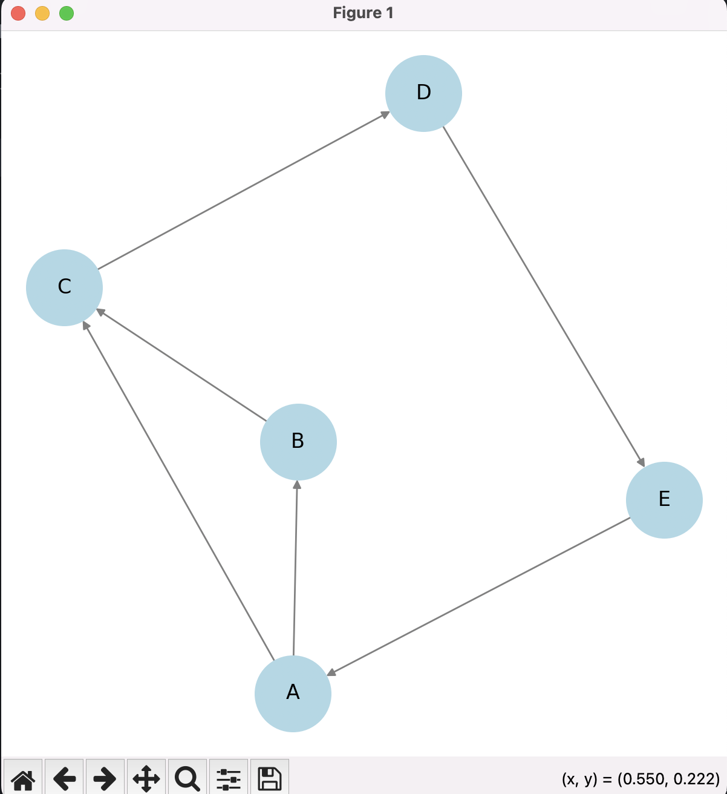
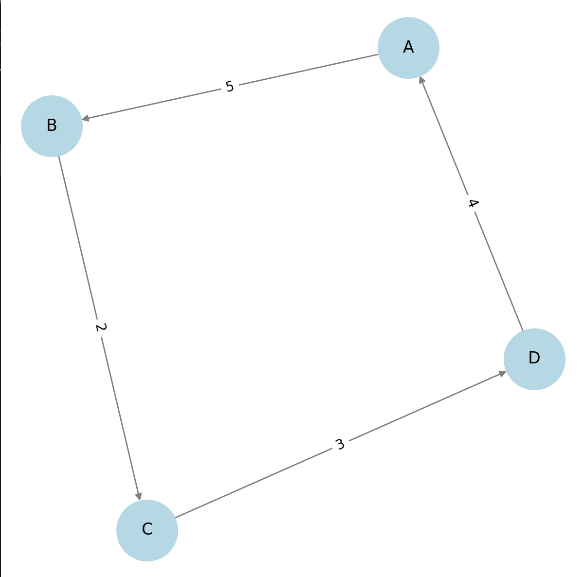
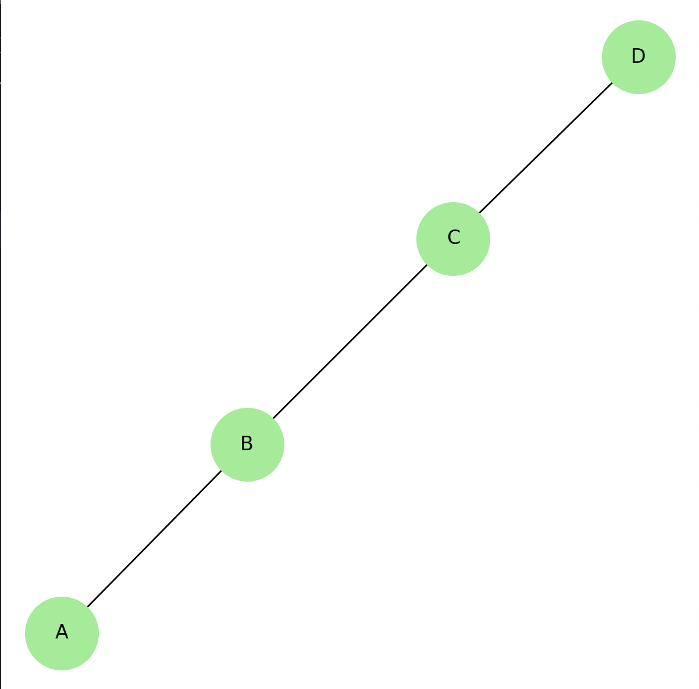
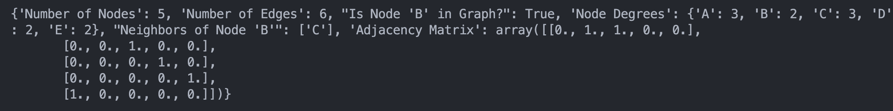

# پروژه تحلیل شبکه با استفاده از NetworkX 3.4.2

## مقدمه

این پروژه بر روی **تحلیل شبکه** با استفاده از کتابخانه **NetworkX (نسخه 3.4.2)** تمرکز دارد. عملیات مختلفی مانند ایجاد گراف، مدیریت نودها و یال‌ها، محاسبه درجات نودها، استخراج زیرگراف‌ها و نمایش گراف‌های جهت‌دار و بدون جهت انجام شده است.

## کتابخانه‌های مورد استفاده

- **NetworkX** (برای عملیات روی گراف‌ها)
- **Matplotlib** (برای نمایش گراف‌ها)
- **NumPy** (برای عملیات روی ماتریس همسایگی)

## ویژگی‌های پیاده‌سازی‌شده

### 1. ایجاد و نمایش گراف جهت‌دار

- نودها: `A, B, C, D, E`
- یال‌ها:
  ```python
  edges = [('A', 'B'), ('B', 'C'), ('C', 'D'), ('D', 'E'), ('E', 'A'), ('A', 'C')]
  ```
- نمایش گراف با استفاده از Matplotlib

### 2. محاسبه ویژگی‌های گراف

- **تعداد نودها و یال‌ها**
- **بررسی وجود یک نود مشخص**
- **محاسبه درجه نودها**
- **یافتن همسایه‌های یک نود مشخص**
- **تولید ماتریس همسایگی**

### 3. تغییرات در گراف

- **حذف نود (`E`)**
- **حذف یال (`A → C`)**
- **استخراج زیرگراف شامل نودهای** `['A', 'B', 'C']`

### 4. اختصاص وزن به یال‌ها و ایجاد گراف وزن‌دار

- اختصاص وزن‌ها به یال‌ها:
  ```python
  weighted_edges = [('A', 'B', 5), ('B', 'C', 2), ('C', 'D', 3), ('D', 'A', 4)]
  ```
- نمایش **گراف وزن‌دار** همراه با نمایش مقادیر وزنی یال‌ها

### 5. تبدیل گراف جهت‌دار به گراف بدون جهت

- تبدیل `DiGraph` به `Graph`
- نمایش **گراف بدون جهت**

## خلاصه خروجی‌ها

این پروژه شامل خروجی‌های زیر است:

- **نمایش گراف جهت‌دار**
- **نمایش گراف وزن‌دار**
- **نمایش گراف بدون جهت**
- ویژگی‌های محاسبه‌شده مانند:
  ```json
  {
    "Number of Nodes": 5,
    "Number of Edges": 6,
    "Is Node 'B' in Graph?": true,
    "Node Degrees": { "A": 3, "B": 2, "C": 3, "D": 2, "E": 2 },
    "Neighbors of Node 'B'": ["C"],
    "Adjacency Matrix": [
      [0, 1, 1, 0, 0],
      [0, 0, 1, 0, 0],
      [0, 0, 0, 1, 0],
      [0, 0, 0, 0, 1],
      [1, 0, 0, 0, 0]
    ]
  }
  ```

## بهبودهای پیشنهادی در آینده

- **پیاده‌سازی الگوریتم‌های کوتاه‌ترین مسیر** (Dijkstra, Bellman-Ford)
- **تحلیل معیارهای مرکزیت** (Degree, Betweenness, Closeness)
- **تشخیص اجتماعات در شبکه**

## نحوه اجرای پروژه

1. نصب وابستگی‌ها:
   ```bash
   pip install networkx matplotlib numpy
   ```
2. اجرای کد:
   ```bash
   python network_analysis.py
   ```

## نتیجه‌گیری

این پروژه یک پایه قوی برای **تحلیل شبکه** با استفاده از **NetworkX** ارائه می‌دهد. عملیات انجام‌شده به درک بهتر ساختار گراف‌ها و تحلیل شبکه‌های واقعی کمک می‌کند.





